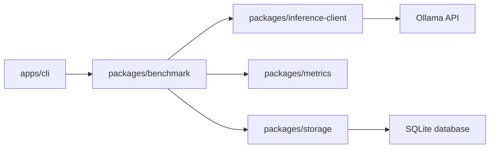

# inference-lab

[](https://github.com/Jaival-Suthar/inference-lab/actions/workflows/ci.yml)
[](LICENSE)
[](https://nodejs.org/)

`inference-lab` is a local LLM inference workspace for Ollama today and future runtimes later.
It is designed as a long-term open-source foundation for experimenting with prompts, streaming, benchmarking, and
lightweight persistence without adding a web server or unnecessary infrastructure.

## What It Is

- A TypeScript and Node.js workspace for local inference experiments.
- A modular CLI that can talk to Ollama from the terminal.
- A benchmark pipeline that records latency, throughput, and token counts.
- A storage layer that keeps benchmark runs in SQLite for later analysis.

## Why It Exists

The project exists to make local model evaluation reproducible, inspectable, and easy to evolve.
It keeps the first release intentionally small so the architecture can grow toward future runtimes, comparison tooling,
and a dashboard without having to rewrite the core.

## Repository Structure

```text
apps/
  cli/              # Command-line entrypoint
benchmarks/         # Benchmark artifacts and example outputs
docs/               # Architecture, CLI, and troubleshooting documentation
packages/
  benchmark/        # Benchmark orchestration
  inference-client/ # Ollama client and request/response types
  metrics/          # Metric models and formatting helpers
  storage/          # SQLite persistence layer
scripts/            # Utility scripts and automation helpers
```

## How It Works



The CLI gathers arguments, the benchmark runner orchestrates a request, the inference client handles the Ollama
transport, and the storage package writes each run to SQLite. Formatting and summaries stay in the metrics package so
they can be reused across commands.

## Installation

```bash
pnpm install
```

Requirements:

- Node.js 22 or newer
- pnpm 11.x
- Ollama running locally at `http://localhost:11434`, or another base URL via `OLLAMA_BASE_URL`

Start Ollama before running the CLI:

```bash
ollama serve
```

## Quick Start

Run a single completion:

```bash
pnpm dev --prompt "Explain KV Cache"
```

Run an explicit model:

```bash
pnpm dev --model qwen3:8b --prompt "Hello"
```

Run a benchmark:

```bash
pnpm benchmark --prompt "Explain KV Cache"
```

Run a streaming benchmark:

```bash
pnpm benchmark --stream --prompt "Explain RAG"
```

## CLI Reference

- `pnpm dev --prompt "Explain KV Cache"` runs the default model through the terminal.
- `pnpm dev --model qwen3:8b --prompt "Hello"` overrides the model for a single request.
- `pnpm benchmark --prompt "Explain KV Cache"` collects metrics and writes the run to SQLite.
- `pnpm benchmark --stream --prompt "Explain RAG"` streams text live while collecting metrics.
- `pnpm benchmark --model qwen3:8b --max-tokens 512 --stream --prompt "Explain KV Cache"` limits the completion length.
- `pnpm compare --models qwen3:8b,gemma3:4b --prompt "Explain Transformers"` compares multiple models.
- `pnpm report --output benchmark-report.md` generates a Markdown report from stored runs.
- `pnpm export --format csv` exports benchmark data for external analysis.
- `pnpm stats` prints stored benchmark statistics.

For the full command reference, see [docs/cli-reference.md](docs/cli-reference.md).

## Typical Workflows

- Run one prompt: `pnpm benchmark --prompt "Explain KV Cache"`
- Run one prompt with streaming: `pnpm benchmark --prompt "Explain KV Cache" --stream`
- Run one prompt with max tokens: `pnpm benchmark --prompt "Explain KV Cache" --max-tokens 512`
- Run 5 benchmarks: `pnpm benchmark --prompt "Explain KV Cache" --runs 5`
- Run benchmark with warmup: `pnpm benchmark --prompt "Explain KV Cache" --warmup 1 --runs 5`
- Compare models: `pnpm compare --models qwen3:8b,gemma3:4b --prompt "Explain Transformers"`
- Export history: `pnpm export --format csv`
- Generate report: `pnpm report --output benchmark-report.md`

## Command Cheat Sheet

| Task              | Command                                                                    |
| ----------------- | -------------------------------------------------------------------------- |
| Single completion | `pnpm dev --prompt "Explain KV Cache"`                                     |
| Specify model     | `pnpm dev --model qwen3:8b --prompt "Hello"`                               |
| Single benchmark  | `pnpm benchmark --prompt "Explain KV Cache"`                               |
| Stream benchmark  | `pnpm benchmark --stream --prompt "Explain KV Cache"`                      |
| Limit output      | `pnpm benchmark --prompt "Explain KV Cache" --max-tokens 512`              |
| Warmup            | `pnpm benchmark --prompt "Explain KV Cache" --warmup 1 --runs 5`           |
| Compare           | `pnpm compare --models qwen3:8b,gemma3:4b --prompt "Explain Transformers"` |
| Stats             | `pnpm stats`                                                               |
| Export            | `pnpm export --format csv`                                                 |
| Report            | `pnpm report --output benchmark-report.md`                                 |

## Sample Output

```text
Model: qwen3:8b
Latency: 1.84 s
TTFT: 0.31 s
Completion: 462 tokens
Speed: 52.4 tok/s
Saved to: inference-lab.sqlite
```

## Documentation

- [Architecture overview](docs/architecture.md)
- [CLI reference](docs/cli-reference.md)
- [Benchmark methodology](docs/benchmark-methodology.md)
- [Runtime configuration](docs/runtime-configuration.md)
- [Troubleshooting](docs/troubleshooting.md)
- [Documentation index](docs/README.md)

## Development Workflow

```bash
pnpm format
pnpm lint
pnpm typecheck
```

Before opening a pull request:

1. Run the checks above.
2. Confirm the CLI still starts against a running Ollama instance.
3. Update the relevant documentation if the public behavior changed.

## Roadmap

The public release focuses on a stable CLI, clean benchmark storage, and a clear architecture.
The next major steps are broader runtime support, richer comparison workflows, and a dashboard.

See [ROADMAP.md](ROADMAP.md) for a concise view of the planned direction.

## Troubleshooting

- If the CLI cannot reach Ollama, confirm `ollama serve` is running and `OLLAMA_BASE_URL` points to the correct host.
- If streaming text does not appear, make sure `--stream` is present on the command line.
- If benchmark files are missing, check that the current working directory is writable.

## License

Released under the [MIT License](LICENSE).
