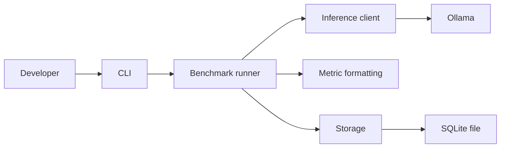

# Architecture

`inference-lab` is organized as a small workspace with clear boundaries between orchestration, inference transport,
metrics formatting, and persistence.

## Layers

- `apps/cli` parses command-line arguments and wires together the packages.
- `packages/inference-client` owns the Ollama transport and request/response types.
- `packages/benchmark` coordinates benchmark runs and collects timing data.
- `packages/metrics` defines reusable result types and human-readable summaries.
- `packages/storage` persists benchmark data to SQLite through Drizzle ORM.

## Data Flow

## Design Goals

- Keep the CLI thin so behavior can be reused by future apps.
- Keep runtime dependencies minimal.
- Preserve a path to additional runtimes such as `llama.cpp` without rewriting the orchestration layer.
- Keep benchmark output and benchmark persistence separate so reporting can evolve independently.

## Package Boundaries

The workspace is intentionally split so each package can be reasoned about on its own:

| Package            | Responsibility                                             |
| ------------------ | ---------------------------------------------------------- |
| `inference-client` | Talk to Ollama and expose typed request/response contracts |
| `benchmark`        | Run model requests and collect metrics                     |
| `metrics`          | Format and summarize results                               |
| `storage`          | Persist runs in SQLite                                     |

That separation keeps the public release understandable for new contributors and leaves room for future expansion.
